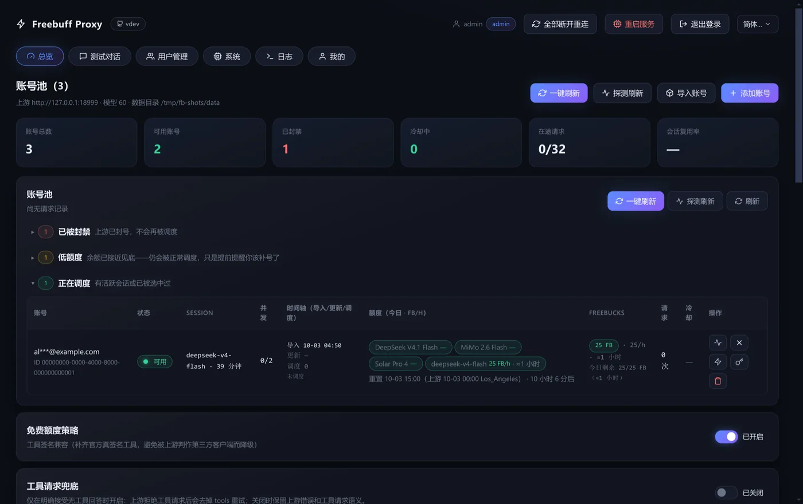
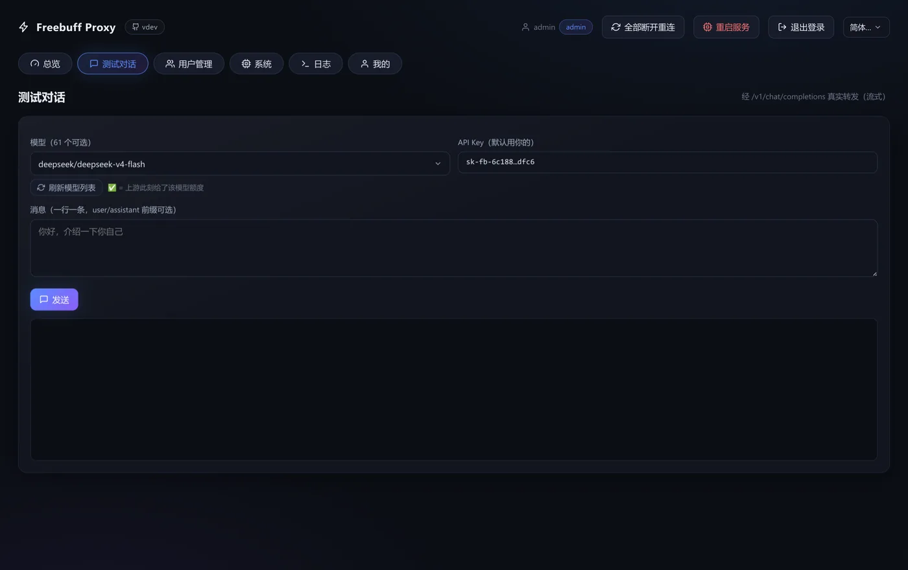
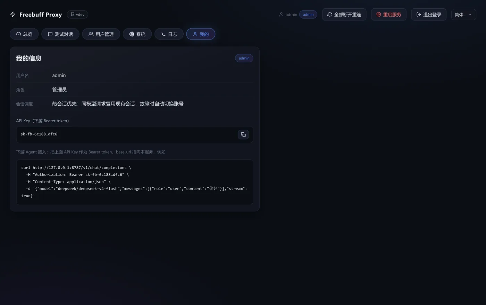
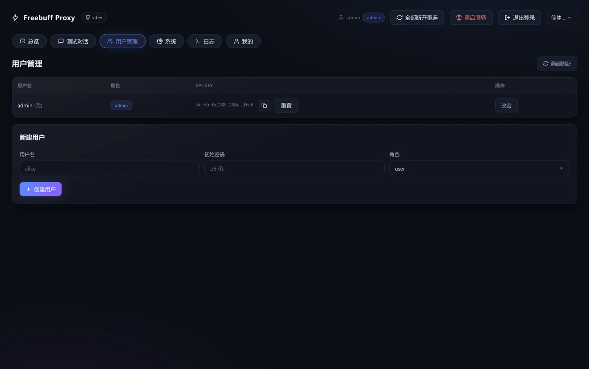

<div align="center">
<h1>freebuff-proxy</h1>
<p><strong>Turn your Freebuff free quota into an OpenAI-compatible API endpoint.</strong></p>
<p>
<a href="https://github.com/HengXin666/freebuff-proxy/releases"></a>
<a href="https://github.com/HengXin666/freebuff-proxy/actions/workflows/docker-image.yml"></a>
<a href="./LICENSE"></a>
<a href="https://nodejs.org"></a>
<a href="https://github.com/HengXin666/freebuff-proxy/pkgs/container/freebuff-proxy"></a>
</p>
<p><strong>Ultra lightweight</strong> . <strong>One-command Docker deploy</strong> . <strong>Everything is managed in the web console</strong></p>
<p>
<a href="./README.md">中文</a> . <a href="./README_EN.md"><strong>English</strong></a>
</p>
</div>

Downstream agents only need the standard `base_url + api_key + model`. This service handles Freebuff credentials (multi-account pool), free-session admission, request shaping and quota scheduling, and passes **streaming / non-streaming responses through unchanged**.

> This project uses Freebuff's official endpoints and is not affiliated with Freebuff. Billing and quota are **ultimately determined by what the upstream returns in real time**.

---

## Screenshots

<p align="center"></p>

<table align="center">
<tr>
<td width="50%">

**Playground** -- a real streaming round-trip through `/v1/chat/completions`



</td>
<td width="50%">

**Me** -- your API key and a ready-to-paste snippet



</td>
</tr>
</table>

**Users** -- create users, change roles, reset keys (admin)

<p align="center"></p>

> Screenshots are generated against a mock upstream with headless Chromium; accounts and API keys are placeholders and masked ([how to reproduce](docs/guide/screenshots.md)).

---

## Quick start

The image is very small: `node:22-alpine` plus only two runtime dependencies (`undici` / `yaml`), tens of MB in total. The whole repo is TypeScript, run directly by Node 22 -- no bundler, no transpiler.

```bash
git clone https://github.com/HengXin666/freebuff-proxy.git
cd freebuff-proxy
cp .env.example .env      # recommended: set ADMIN_PASSWORD
docker compose up -d      # pulls the prebuilt GHCR image, no local build
```

Open `http://<host-ip>:8787/` in a browser, log in as admin, then use **Overview → + Add account** to complete the Freebuff sign-in callback.

```bash
docker compose logs freebuff-proxy | grep -A6 "首次启动"   # random password when ADMIN_PASSWORD is unset
docker compose logs -f      # logs
docker compose pull && docker compose up -d   # upgrade
docker compose down         # stop (data stays in ./data)
```

> Networking is **host mode**: the container shares the host network stack and listens directly on `0.0.0.0:<PORT>`, so no port mapping is needed (`ports` is ignored under host mode).
> To build locally: replace `image:` in the compose file with `build: .` and run `docker compose up -d --build`.

---

## Connect in three steps

These three values are all an agent needs; everything else is a click in the console:

| What | Value |
|---|---|
| `base_url` | `http://<host-ip>:8787/v1` |
| `api_key` | your own key (`sk-fb-...`) from the console's **Me** page |
| `model` | any model name returned by `GET /v1/models` |

```bash
curl http://127.0.0.1:8787/v1/chat/completions \
  -H "Authorization: Bearer sk-fb-xxxxxxxx" \
  -H "Content-Type: application/json" \
  -d '{"model":"deepseek/deepseek-v4-flash","stream":true,
       "messages":[{"role":"user","content":"hi"}]}'
```

Main endpoints:

| Path | Purpose |
|------|---------|
| `POST /v1/chat/completions` | main path (session + passthrough) |
| `GET /v1/models` | available model catalog |
| `GET /v1/freebuff/status` . `GET /v1/freebuff/accounts` | account and session snapshot, cooldown state |
| `GET /healthz` | liveness probe |

---

## Where to configure things

**Day-to-day operation happens entirely in the console -- no config file editing.**

| To change | Where | Stored at |
|---|---|---|
| Proxies (global pool) | Console **Proxy settings**: add / remove / test / save, effective immediately | `/data/proxies.json` |
| Accounts | Console **Overview → + Add account**: import JSON or browser sign-in callback | `/data/credentials/` |
| Users and API keys | Console **Users**: create / delete / change password / reset key | `/data/users.json` |
| Admin password | `ADMIN_PASSWORD` in `.env`, or the random value printed on first start | `.env` |

`config.yaml` is only a fallback default, not the day-to-day entry point. The single source of truth for every option is in the [configuration reference](docs/guide/configuration.md).

---

## Scheduling: pick which accounts get used

Every account row has a **Schedule** switch (on by default):

- **On** = eligible: the account can be picked and may open a new session.
- **Off** = excluded: never enters the candidate list, is never picked, never admits.
- Turning it off **does not release a session** -- the hour you already paid for is kept until it expires, and switching it back on reuses that same hour at no extra cost.
- The state lives in the ledger `/data/account-state.json`, so it **survives restarts**.

Use it to pin a subset of accounts (e.g. keep a few in reserve) without deleting credentials or waiting out a cooldown.

---

## Billing and quota

The upstream bills in **Freebucks (FB)**: each model has an hourly price, and **one admit buys a whole hour** -- further requests inside that hour cost **nothing at the margin**, while an early `DELETE` **does not refund Freebucks**. Hence the service **never releases a session just because it is idle** (see [scheduling and quota protection](docs/design/scheduling.md#额度保护freebucks-计费控制台可调)). The daily pool resets at Pacific midnight (about 25 FB on the standard tier, 20 measured when going through a proxy).

There is no static upstream price list to quote; pricing arrives in every session response as `freebucks.prices`. This service **never hardcodes prices** and reads the live values:

```bash
npm run pricing            # human-readable live price list (GET probe: creates no session, spends no quota)
npm run pricing -- --json  # machine-readable
```

---

## Upstream request path

There is **exactly one** upstream path: the Node service **RPC-delegates the request to `cli-bridge/`** (the same bun runtime the official client uses), which sends it **byte-for-byte by the official client capture**: the official 37 tools, the official system template, the desktop-generation agent, layered providers.

The main service **no longer assembles upstream requests itself**: the old self-assembled shape (CLI preamble + hand-written tool signatures + CLI-generation agent + self-managed session scheduling) is **deprecated and blocked** (`config.resolveUpstreamChannel()` forces a fallback and warns; the console option is disabled). It differed from the official capture **field by field** and made admission fail repeatedly in testing (`purchase_claim_released`), producing the illusion of "it runs but everything is rejected". **There is one implementation of the protocol** (in `cli-bridge/`); the main service passes parameters and streams the response back.

**Client-supplied tools** are merged, not replaced: official tools first (to satisfy the tool fingerprint) plus client tools appended, de-duplicated by name. Note the proxy **does not execute** tools -- it returns upstream `tool_call`s unchanged and the client runs them.

Details: [channel selection and tool mapping](docs/reverse/18-channel-guide-and-tool-mapping.md).

---

## Limits (the reality of the official free tier)

- **Per-model daily sessions are capped**: the limited tier measured **6 sessions per model per day**. Once used up the model returns 503 and the purchase is refunded and voided -- which is **why a multi-account pool is a hard requirement**. Check `rateLimitsByModel` first (the **Quota** column in the console).
- **Concurrency slot is `slotLimit: 1`** and is **mutually exclusive with the official client**: while the official client uses the same account, this service gets `purchase_in_use` / `purchase_capacity`.
- Region / VPN / bans are decided upstream; this project does **not** bypass risk control and does **not** promise unlimited quota.

---

## FAQ

**Cannot log in / forgot the admin password?** Check `docker compose logs freebuff-proxy | grep -A6 "首次启动"`; if `ADMIN_PASSWORD` is set it wins. See [Web console](docs/guide/web-console.md).

**Container cannot reach a proxy on the host?** Under host mode just put `http://127.0.0.1:<port>` into the console's **Proxy settings** -- no gateway IP needed. See [Proxy support](docs/guide/proxy.md).

**Plenty of quota left but getting 429 / constant 503?** Check the `rateLimitsByModel` in the console's **Quota** column first. A 503 is a **model-side** problem; switching accounts will not fix it. See [Multi-account pool and scheduling](docs/design/scheduling.md).

**Changed the upstream base URL in `config.yaml` and nothing happened?** The upstream API base is hardcoded; only the `FREEBUFF_UPSTREAM_API_BASE` environment variable overrides it (for local comparison / contract tests only).

**Connections hang forever?** There is an idle timeout and release-on-disconnect. See [Connection health](docs/guide/connection-health.md).

---

## Documentation

Full index and source-of-truth declarations: [docs/README.md](docs/README.md). Common entry points:

| Document | Contents |
|------|------|
| **[Deployment and operations](docs/guide/deployment.md)** | What lives in `/data`, persistence and backup, automated image builds |
| **[Web console](docs/guide/web-console.md)** | Login and password recovery, adding accounts, users and API keys |
| **[Configuration reference](docs/guide/configuration.md)** | Single source of truth for every option |
| **[Proxy support](docs/guide/proxy.md)** | Global proxy pool, egress assignment, connectivity tests |
| **[Connection health](docs/guide/connection-health.md)** | Ghost-connection cutting, release on client disconnect, restart fallback |
| **[Multi-account pool and scheduling](docs/design/scheduling.md)** | Automatic failover, sticky-first scheduling, quota semantics and protection |
| **[Scheduling and refund research history](docs/design/account-scheduling-and-refund.md)** | How the billing semantics were corrected, with first-hand evidence |
| **[Downstream agent integration](docs/design/api.md)** | `chat/completions` behaviour, all routes, bulk account import |
| **[Code quality landscape](docs/quality/code-quality-landscape.md)** | Red lines, gates and current status (for maintainers) |
| **[Protocol reverse engineering](docs/reverse/00-overview.md)** | Official client protocol: device signing, session admission, chat and tools, capture archive and field-by-field diff |

---

## Notes

- **Releases and changelog**: [Releases](https://github.com/HengXin666/freebuff-proxy/releases)
- [MIT License](./LICENSE). This project uses Freebuff's official endpoints for personal convenience only; comply with its terms of service and accept the account risk yourself.
